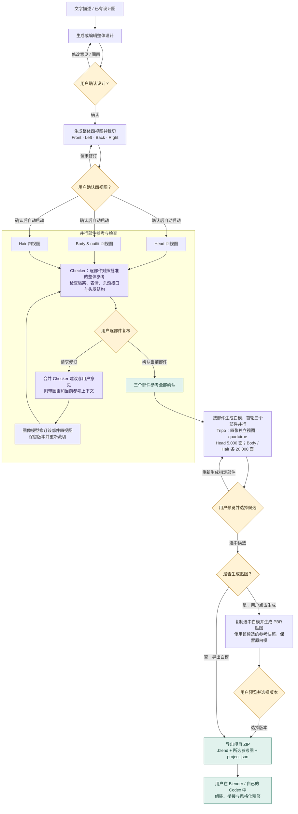

# Agentic 3D Asset Factory

一个面向角色创作者的 AI 资产制作工具：从文字或已有设计图开始，生成整体四视图和部件参考图，分别制作 Head、Body & outfit、Hair 的三维资产，最终交付可继续编辑的 Blender 项目与对应参考图。

**当前是已跑通主要流程的早期 demo。** 我们已验证真实图片生成、三部件生成、贴图、浏览器预览以及包含原生 `.blend` 的项目 ZIP 导出；尚未证明它在多个角色上稳定优于整个人物一次生成，也不把当前输出称为已完成绑定的生产级角色。

## 用户与产品边界

目标用户是需要角色模型初稿、但不想反复在多个生成工具之间传递图片和整理资产的创作者。软件把参考、反馈、检查、生成与交付组织在同一个角色项目里，并保留部件独立编辑的可能。

我们的交付终点是 **可打开的 Blender 资产和所选版本的参考图**。Head、Body、Hair 已放进同一个场景，但仍保留生成时的位置和尺度；位置、比例、颈部衔接和穿插需要后续调整。它们不自动合并，也没有完成骨骼绑定。

用户可以用 Blender 基础操作完成组装，或者在自己的 Codex 中打开解压后的项目文件夹继续调整。项目成员的一次 Jinx 试用表明，组装可以用基础 Blender 操作完成，外部 Codex 辅助的额度消耗也较低；这是单次可行性观察，不是对所有角色的耗时或费用保证。

**目前不计划在软件内嵌一个复刻 Codex 能力的 Blender Agent。** 用户已经拥有的 Blender/Codex 可以承担开放式精修；重新实现同等工具访问、上下文和操作能力会增加工程维护和 API 成本。我们将开发资源集中在参考一致性、部件质量、反馈效率与可靠交付上。这是当前的产品范围选择，仍需用实际用户测试检验。

## Track 2：项目要回答的五个问题

本节对应课程作业 **Track 2: Agentic Framework Design** 的五项要求（作业说明第 5–6 页）。题目允许使用预训练模型与商用 API，要求贡献超出一次基础模型调用，并通过完整 demo 展示从用户输入到输出的可用工作流。以下区分当前实现、已有观察与待验证的优势。

### 1. Problem and users：谁使用？解决什么问题？为什么重要？

**目标用户**是有角色设计图或明确设计想法、希望制作可编辑三维初稿的独立创作者、小型游戏团队和角色制作学习者。这个用户定位是当前产品假设，尚未通过访谈或用户研究验证。

他们要完成的任务是：把二维角色设计转成三维资产，在脸、发型或服装不满意时进行局部迭代，并把结果交给 Blender 继续制作。主要痛点有三类：

- **流程分散**：参考图生成、四视图准备、3D 生成与导出分别涉及不同工具，用户需要传递图片、整理文件并追踪版本。
- **局部修改牵连整体**：当完整角色只有头部或头发不满意时，重新生成整个角色可能改变已经满意的部分。部件拆分为局部重做提供了可能，但也增加组装工作。
- **问题难以转成修订要求**：用户能看出“不像”或“不协调”，却未必能具体描述多视角表情、部件隔离和接口结构的问题，导致反复尝试。

这些问题关系到迭代的操作负担、调用费用与资产能否继续编辑。Jinx 试用提供了具体例子：派生头部与整体风格不协调、头颈衔接需要调整、衣服纹理局部模糊或串色。不过，单个内部案例只能支持问题存在，不能证明普遍需求或节省幅度；还需记录用户原有流程、实际操作次数与耗时。

### 2. Tool design：用户怎么用？主要功能是什么？相对替代方案有什么优势？

**当前用户体验**：上传设计图或输入描述 → 确认整体设计 → 确认整体四视图 → 检查并修订 Head、Body & outfit、Hair 参考 → 确认后生成白模 → 旋转预览并选择候选 → 按需生成贴图 → 导出原生 Blender 项目包。下方流程图展示具体确认点与反馈循环。

用户决定视觉目标、修订调用与接受标准；系统传递参考、组织检查意见、并行生成部件并保存版本。Checker 对生成的部件参考与批准的整体参考进行视觉比较，输出问题和修改建议；下一轮图像修订将这些建议与用户意见一起使用。这是当前判断参与行动的环节，人工确认用于控制审美取舍与付费修订。

| 替代方案 | 本项目提供的区别 | 需要验证的优势 |
|---|---|---|
| 直接用 3D API 生成完整角色 | 分别生成和选择头、身体与服装、头发 | 局部重做是否更方便；质量收益能否抵消额外生成与组装成本 |
| 手动串联图像、3D 与 Blender 工具 | 在同一项目中管理参考、反馈、候选与 `.blend` 交付 | 是否减少文件搬运、版本混淆与操作耗时 |
| 相同部件流程，但没有 Checker | 将视觉检查结果加入用户发起的修订 | 是否改善参考质量、减少漏检或降低反馈负担 |

目前可以展示上述功能差异；尚不能据此声称比替代方案更快、更便宜或效果更好。自动裁切、并行调度和打包属于工程自动化；Checker 的视觉判断与修订反馈是 Agentic 部分。当前采用固定阶段和人工参与的反馈循环，开放式工具选择与自主修复尚未实现。

### 3. Deep learning approach：模型、输入输出、数据与评估是什么？为什么这样选？

| 模块 | 输入 → 输出 | 选择理由与边界 |
|---|---|---|
| 图像生成模型 | 描述、批准参考、圈画与修改意见 → 整体图或部件四视图 | 用视觉参考保留设计细节，并允许局部修订；不能保证身份和视角完全一致 |
| 视觉语言 Checker | 部件四视图 + 批准的整体参考 → 结构化问题、视角、严重程度和修订建议 | 隔离、表情和头发走线需要视觉语义判断；判断准确性需人工标注验证 |
| Tripo 几何生成 | 每个部件的四张独立视图 → 无材质三维候选 | 将局部参考转为独立可编辑资产；请求四边形和目标面数不等于质量保证 |
| Tripo 贴图生成 | 选中几何的副本 + 该候选的参考快照 → PBR 贴图资产 | 分开选择几何与材质，保留原白模并避免参考版本混用 |

数据来自用户提供的设计图、系统生成的参考与模型，以及流程中的反馈和检查结果；当前不训练自有模型，也没有自建训练数据集。用于展示和评估的角色需记录来源及使用权限。模型版本、输入顺序和面数配置见后文“技术设计与 Agent 的职责”。

评估应同时覆盖 **参考一致性、结构问题、局部编辑耗时、交付可靠性与实际成本**。Checker 还需单独记录与人工判断的一致性、误报和漏报；不能用 Checker 给自己输出的分数替代人工评价。使用商用模型的理由是把课程开发集中在参考组织、判断反馈、部件迭代和可靠交付；具体模型是否最佳仍需对照证据。

### 4. Implementation and evaluation：哪些已经跑通？如何证明有用？哪里失败？

**已实现并验证的范围**：Jinx 的真实参考生成、三部件白模、贴图、浏览器预览和原生 `.blend` 项目导出已跑通；导出文件已通过后台 Blender 重开检查。软件测试验证阶段约束、版本关联和交付行为，不能替代资产质量和用户体验评估。

**Jinx 展示实验已整理**：[分件生成、装配与整体生成对照](docs/JINX_EXPERIMENT.md)汇总设计、四视图、三部件交付、装配全身、脸部和背面 baseline 对照，以及 Blender 局部修复记录。现有结果支持拆分可行性与局部编辑价值；分件脸部细节更明确，但整体风格仍有偏移，不能概括为总体质量全面超过 baseline。

**第二个案例：二次元角色的下游制作与舞台展示。** 2026-10-04，项目成员确认 `v2_soft_anime_trial.blend` 案例也已跑通，并提供 Blender 当前场景截图：角色已进入舞台场景，具有动作姿态，场景中包含 MMD Motion System。结合已有绑定、动作适配与检查记录，该案例支持资产经过外部 Blender/Codex 和人工处理后，可以进一步用于舞蹈展示。它与 Jinx 的应用生成与导出案例共同覆盖“取得可编辑资产”和“继续完成下游制作”两个使用环节。当前截图展示一个动作帧；完整播放效果在 presentation 中用录像呈现。该案例的外部处理需单独说明，不能算作应用已实现自动绑定，也不能沿用 Jinx 的调用费用。

**已有失败与局限案例**：Jinx 的独立头部与身体风格不协调，头颈接口需要手动处理，前胸与背带纹理不够清楚。后续 Blender/Codex 精修中也出现过误伤脸部及辫子变形，需要恢复；这是外部精修风险，必须与应用原始生成结果分开记录。当前证据证明流程可执行，尚未证明部件方案或 Checker 的总体增益。

**待执行的比较**：使用相同角色和批准的整体四视图，对比“整体直接生成”“部件生成 + Checker”“部件生成但无 Checker”。记录原始输出，并在相同人工精修时间或相同外部辅助预算下再次比较；统计所有调用、失败、重试、组装与精修成本。具体实验规则和指标见后文“计划中的 baseline 与评估”。

课堂 demo 应展示一次从输入设计到项目导出的完整链路，并展示一个 Checker 发现问题、用户提出意见、生成修订后再次检查的实例。若展示精修后的角色，应同时提供原始输出并说明额外处理。按作业要求准备备用录像。

### 5. Limitations and risks：技术局限、隐私和其他风险是什么？

- **视觉一致性**：整体图派生局部参考时可能改变角色身份，四视图之间也可能存在比例或表情差异；Checker 不能保证发现所有问题。
- **三维可用性**：部件独立生成会增加尺度、位置、接缝和穿插处理；目前不自动完成组装、焊接、绑定或动画，也不保证生产级拓扑。
- **调用与恢复**：付费生成有随机性和等待时间。确认部分阶段会自动启动后续生成，需清晰说明费用后果；结果未知时先核对供应商任务，避免重复提交。逐操作费用预估和预算上限尚待完善。
- **隐私与权限**：输入设计和选中参考会发送给模型供应商；当前本地 demo 尚未提供面向多用户部署的身份认证与项目隔离。参考图、角色和样例的使用及再分发权限需核实，不能把 Jinx 演示当作商业授权证据。
- **证据范围**：内部单例不足以支持通用质量、平均费用或效率优势。报告需要明确区分应用功能、外部精修、待执行实验和实测结果，并披露实际 LLM 使用与成员贡献。

## 当前工作流

下面展示当前已实现的流程。Checker 对每个新生成的部件参考进行视觉检查；是否修订、是否接受由用户决定。



**循环中的职责**：Checker 负责识别问题并提出修订建议；系统把建议与用户意见加入下一轮图像生成；用户控制修订调用和参考批准。检查结果不会自行触发付费重生成，用户也可以复核后接受当前版本。当前 Checker 检查的是部件参考图，3D 候选与贴图由用户预览和选择。生成新版本会保留历史，上游变更会将相关下游结果标记为待更新。

1. **整体设计**：文字生成或已有图像生成；设计描述选填。上传参考图、圈画问题并填写修改意见。
2. **整体四视图**：确认整体设计后自动生成 Front / Left / Back / Right。要求适合后续建模的初始站姿、适当腿间距；自动裁切后由用户检查。
3. **并行部件参考**：确认整体四视图后，并行生成 Head、Body & outfit、Hair 的四视图。每个部件继承整体参考，并单独检查、修改和确认。
4. **AI 结构检查**：检查部件隔离、表情一致性、头颈接口、头发残留脸/耳朵和刘海走线等。用户生成修订版时会结合检查建议与自己的意见。检查是辅助判断，不会自动无限重试。
5. **并行白模生成**：三个部件参考全部确认后，分别上传四张独立视图到 Tripo，先生成无材质模型。可逐部件旋转查看、比较候选或重新生成。
6. **可选贴图**：对选中的白模点击 Generate texture。系统复制原白模，在副本上生成贴图，并使用该候选的四视图输入；原白模和已有结果保留。提交贴图后原白模仍可生成新的几何候选。
7. **项目导出**：选择各部件的候选版本，输出 `项目名.zip`。解压后直接打开 `.blend`，或把整个文件夹交给用户自己的 Codex。

左侧按整体设计 → 四视图 → 并行部件 → 3D 解锁；已完成步骤可以返回。上游变更会使相关下游结果标记为待更新。参考和模型版本保留在应用内，**项目交付包不包含历史消息或全部历史图片**。

## 项目交付包

例如 Jinx 项目：

```text
Jinx.zip
├── Jinx.blend
├── references/
│   ├── design.png
│   ├── turnaround.png
│   ├── head.png
│   ├── body.png
│   ├── hair.png
│   └── views/
│       ├── turnaround/{front,left,back,right}.png
│       ├── head/{front,left,back,right}.png
│       ├── body/{front,left,back,right}.png
│       └── hair/{front,left,back,right}.png
├── project.json
└── README.md
```

`.blend` 内包含选中的三个部件与已生成的贴图。参考图只包含所选模型对应的版本；部件裁切图使用该候选实际提交的不可变输入快照。`project.json` 记录所选模型和参考图的对应关系，不导出编辑消息、AI 检查历史或密钥。

**Export component** 单独下载 `项目名_head.blend`、`项目名_body.blend` 或 `项目名_hair.blend`。白模也可导出，贴图和最终确认不是导出的前提。

导出服务后台运行 Blender、打包纹理并保存真实 `.blend`；用户无需再运行导入脚本。保存窗口在支持的浏览器中可选择位置，其他浏览器使用默认下载方式。旧的模型＋导入脚本 ZIP 接口仅保留兼容用途，不是当前项目导出按钮的交付形式。

## 技术设计与 Agent 的职责

- **OpenAI 图片服务**：整体设计、四视图和部件参考的生成与修订。
- **视觉检查模型**：结合部件图与整体参考输出结构问题建议。当前默认配置为 `gpt-5-mini`，可通过 `OPENAI_REVIEW_MODEL` 更改。
- **项目上下文**：保存角色身份、当前批准参考、依赖、反馈及不可变模型输入快照，避免把不同版本混在一起。
- **Tripo P2.0**：当前几何配置为 `P2-20260801`；输入顺序为 front、left、back、right，四张图分别上传，不把四宫格当作单张输入。
- **几何与材质分离**：始终请求 `quad=true`；Head 目标 5,000 面，Body/Hair 各 20,000 面。这些是请求设置，实际面数及四边形比例需要检查原始文件。
- **贴图**：使用独立纹理模型 `v3.5-20260815`、`detailed` 和 PBR。4K 是目标；当前 Jinx 实测为 4096×4096，不代表未来每次输出都保证该分辨率。
- **预览与导出**：Three.js 提供白模、原始材质、双面显示和线框。网页渲染会三角化，不能据此判定原始 FBX 的四边形拓扑。Blender 在服务端生成并缓存可携带贴图的场景文件。

Agent 能力主要体现在基于参考和生成结果进行结构判断，并把判断融入修订。并行调度、裁切、状态管理和打包属于工程自动化。当前是 **人工参与的 AI 工作流**，不是自主完成建模、组装和绑定的通用 Agent。核心贡献是可用的工作流与可追溯交付，而不是训练新的生成模型。

## 计划中的 baseline 与评估

以下是待执行实验，尚无已完成的对照结果。研究问题是：**把角色拆成部件生成，是否比整体一次生成更贴近参考、更少结构问题，并更方便后续编辑？**

| 方案 | 输入与流程 | 要检验的内容 |
|---|---|---|
| Baseline：整体直接生成 | 同一组批准的整体四视图，裁成四张独立图片，直接调用 Tripo 生成完整角色 | 现有生成服务的直接使用效果 |
| 我们的流程：部件生成 | 从同一整体四视图生成部件参考，分别生成 Head、Body、Hair，导出同一 Blender 场景 | 部件拆分、参考管理和工作流的总体价值 |
| 补充消融：无 AI 检查 | 使用同样的部件流程，但不向修订加入 AI 结构检查建议 | AI 检查能否改善结果或减少人工反馈 |

### 公平比较规则

- 固定相同角色设计、整体四视图、Tripo 几何版本和四边形要求。双方都按接口要求上传四张独立图，不能让 baseline 只使用一张四宫格。
- 区分两类证据：先检查生成原始输出，再比较经过相同人工修整时间或相同外部 Codex 预算后的结果。我们的组装与精修也必须计入。
- 报告图片、视觉检查、几何、贴图及重试的全部调用成本，同时记录人工时间、等待时间、候选数量和成功率。
- 部件方案的总目标面数为 45,000。整体模型的可用面数受对应 API 限制；报告双方请求和实际面数，不能默认它们相同。能在接口限制内实现预算匹配时，再做额外控制实验。
- 主实验允许工作流投入不同，但结论应表达为质量／编辑便利性与额外成本的权衡，不能据此声称同成本必然更好。
- 首轮计划使用 3–5 个不同复杂度的角色；预算允许时重复生成，避免只展示一个最好的随机结果。保留失败案例，不把小样本结果包装成普遍结论。

### 建议指标

1. **参考一致性**：脸、发型、服装、配色及多个视角的一致性。预先制定评分标准，由不知方案标签的评审评分。
2. **结构问题**：缺失、粘连、穿插、头发残留解剖结构及头颈衔接问题；图片检查和真实模型检查分开记录。
3. **可编辑性**：完成头发替换、头部调整等指定任务的耗时、操作数和影响范围。
4. **交付可靠性**：项目包能否解压，`.blend` 能否打开，贴图是否嵌入，模型与参考版本是否一致。
5. **成本与效率**：每角色实际费用、重试次数、人工修整时间和端到端等待时间。

直接生成对照主要检验部件策略，不单独证明 Agent 的增益。无 AI 检查的消融用于检验判断环节。自动测试用于检查软件行为，也不能替代上述资产效果评估。

## 后续开发方向

按优先级推进，先验证价值，再扩大范围：

1. **收敛 demo、补实验**：完成 baseline、失败记录、实际费用与组装时间统计；准备完整演示和备用录像。
2. **拆清数据与服务边界**：把项目记忆、图片生成、视觉检查、模型生成、预览和导出进一步模块化，整理明确的版本依赖与测试。
3. **改进参考与接口一致性**：检查四视图比例、表情、颈部截面和头发隔离；降低拼接时需要的手动调整。
4. **强化检查与候选选择**：验证视觉检查准确性，再尝试有限次数的检查—修订闭环或多候选排序。保留人工接管，先设置费用与重试上限。
5. **改善交付与使用体验**：清晰的成本和任务状态、取消/失败提示、导出进度、跨系统部署与服务端 Blender 配置。
6. **需要时再产品化**：用户认证、项目隔离、文件配额、队列、数据清理和隐私说明。目前仅面向本地开发与课程 demo。

暂不承诺自动绑定、生产级拓扑、大规模角色工厂或软件内置 Codex。后续是否开发简单对齐辅助，应由 baseline 中的组装负担和用户反馈决定。

## 本地启动

需要 Python 3.13+、uv、Node/npm。原生 `.blend` 导出还需要 **运行后端的机器**安装 Blender；下载资产的客户端不需要安装 Blender，打开文件时才需要。

```bash
uv sync --locked
npm ci
uv run uvicorn --app-dir src asset_factory.studio:create_app --factory --host 127.0.0.1 --port 8765
```

打开 <http://127.0.0.1:8765>。使用单个服务进程，不要开启多个 worker。

在本目录创建或编辑 `.env`；已有文件不要覆盖，变量示例见 [.env.example](.env.example)：

```dotenv
OPENAI_API_KEY=
OPENAI_IMAGE_MODEL=gpt-image-2.5-sunburst
OPENAI_REVIEW_MODEL=gpt-5-mini
TRIPO_API_KEY=
TRIPO_MODEL_VERSION=P2-20260801
BLENDER_BINARY=
```

图片模型名为当前开发配置，账号访问权限可能不同，可替换为账号可用模型。兼容 `ChatGPT_API_KEY` 和 `Tripo_AI_API_KEY`。`BLENDER_BINARY` 填写服务端 Blender 可执行文件路径；也支持自动发现本机常见及 Steam 安装位置。配置变更后重启服务。

没有图片密钥时仅能使用本地演示模式；它需要本机 `fixtures/` 样例，样例和生成资产不随源码提交，因此干净克隆不能假定自带可回放角色。

密钥只在服务端使用。当前开发模式不限制调用次数；图片、检查、3D 和贴图 API 均可能计费。确认整体四视图会自动启动部件参考生成，确认最后一个部件会自动启动三维任务。ChatGPT/Codex 订阅不能替代本软件的 API 账单。未知结果或中断任务不会自动重试，应先核对原任务。

## 已验证的范围与已知局限

截至 2026-10-04，45 项测试通过；Jinx 的真实流程及项目导出已验证。后台 Blender 5.2.2 成功重新打开流水线输出，确认三个网格和 12 张嵌入的 4K 贴图。项目 ZIP 的参考选择测试核对了导出裁切图与所选模型输入的字节一致性。

这些结果证明流程可行，不等于多角色的质量保证。面数较高不必然改善脸部细节；提示词也不能保证四视图几何一致、无粘连或可绑定拓扑。单张正面截图不能替代完整三维检查。首次流程测试的用户报告消耗为 595 个 Tripo API 积分和 $0.43 OpenAI 费用，按 100 积分／美元折合 $6.38；这不是稳定的单角色生产成本，仍需核对账单并区分重试与开发调用。约 $3.5／角色是已被这次实测更新的早期估算。外部 Codex 的订阅费用分摊单独记录，计算假设见报告草稿。

用户输入和选中的参考图会发送给相应模型供应商；部署前需处理权限、隐私与数据保留。角色参考的使用权限也需由项目成员确认。课程提交应披露实际 LLM 使用、外部模型和代码来源，并记录每位成员的贡献。

```bash
uv run pytest -q
uv run ruff check src tests
```

生成图片、模型、项目数据库、导出文件、浏览器截图和 `.env` 均不纳入源码提交。必要样例应另行提供可授权访问的输入与复现说明。

## 进一步阅读

- [课程报告草稿与待完成实验](docs/PROJECT_REPORT.md)：英文草稿，区分现有证据、待执行 baseline、消融及开发优先级。
- [实现与验证记录](docs/REFERENCE_STUDIO.md)：包含阶段性历史，当前行为以本 README 和代码为准。
- [架构草案](docs/ARCHITECTURE.md)
- [Python 与 uv 环境](ENVIRONMENT.md)
