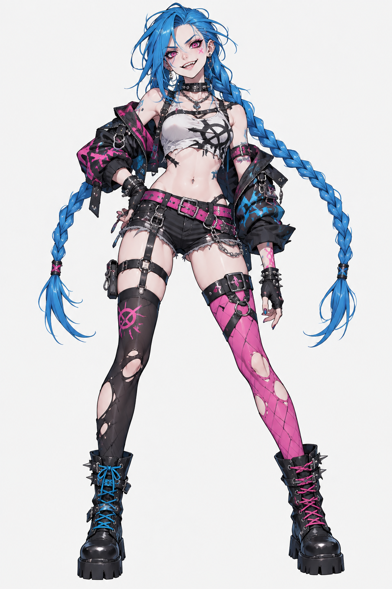
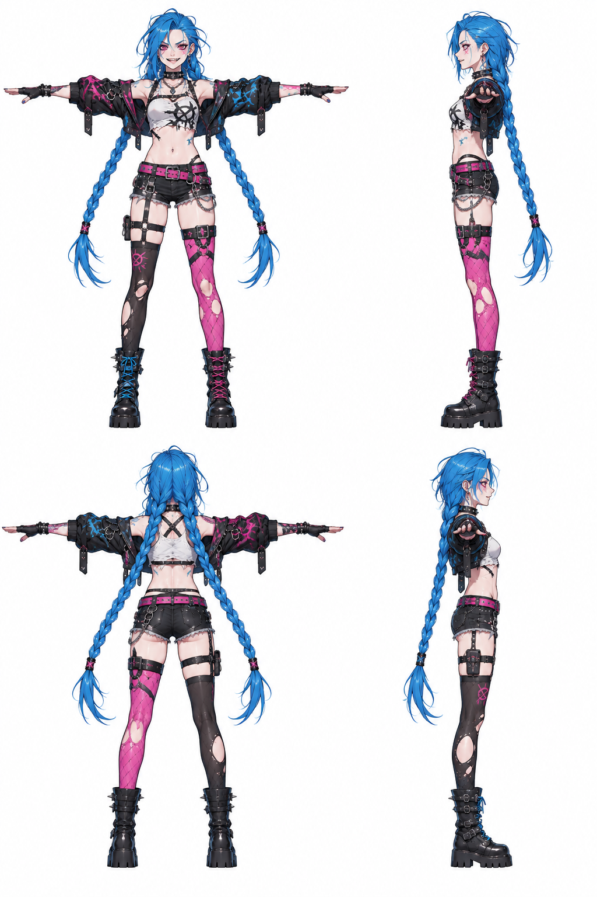
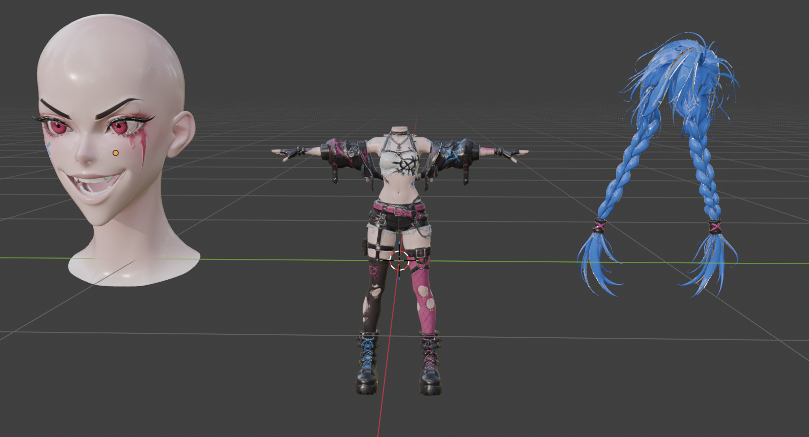
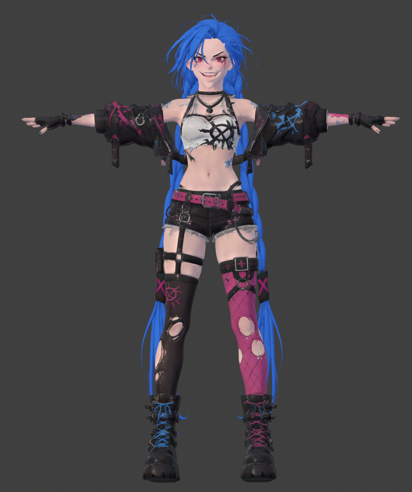
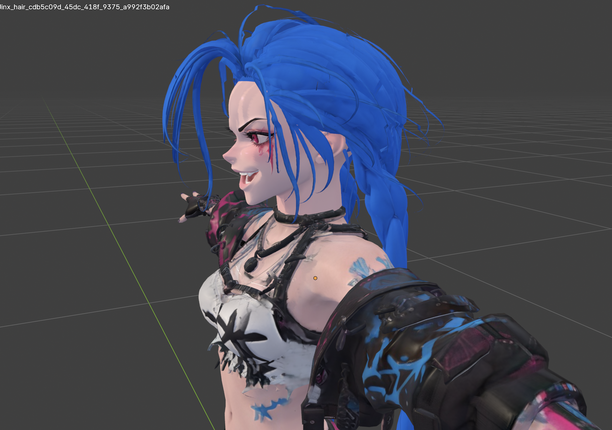
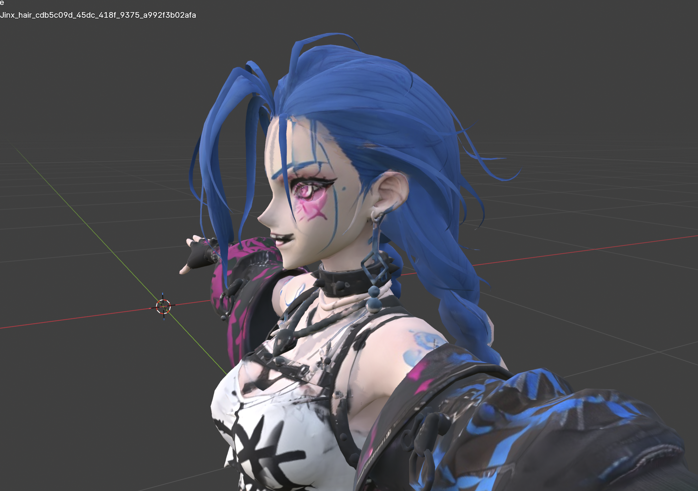
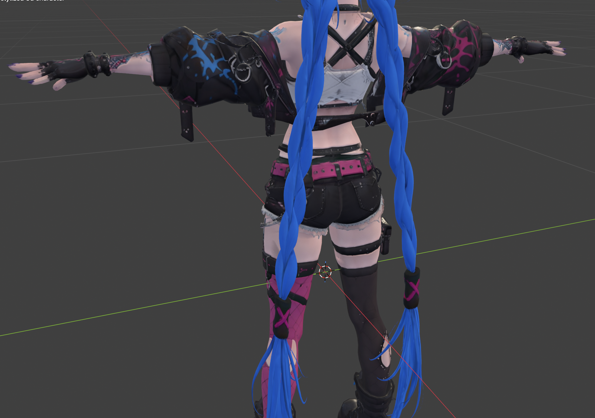
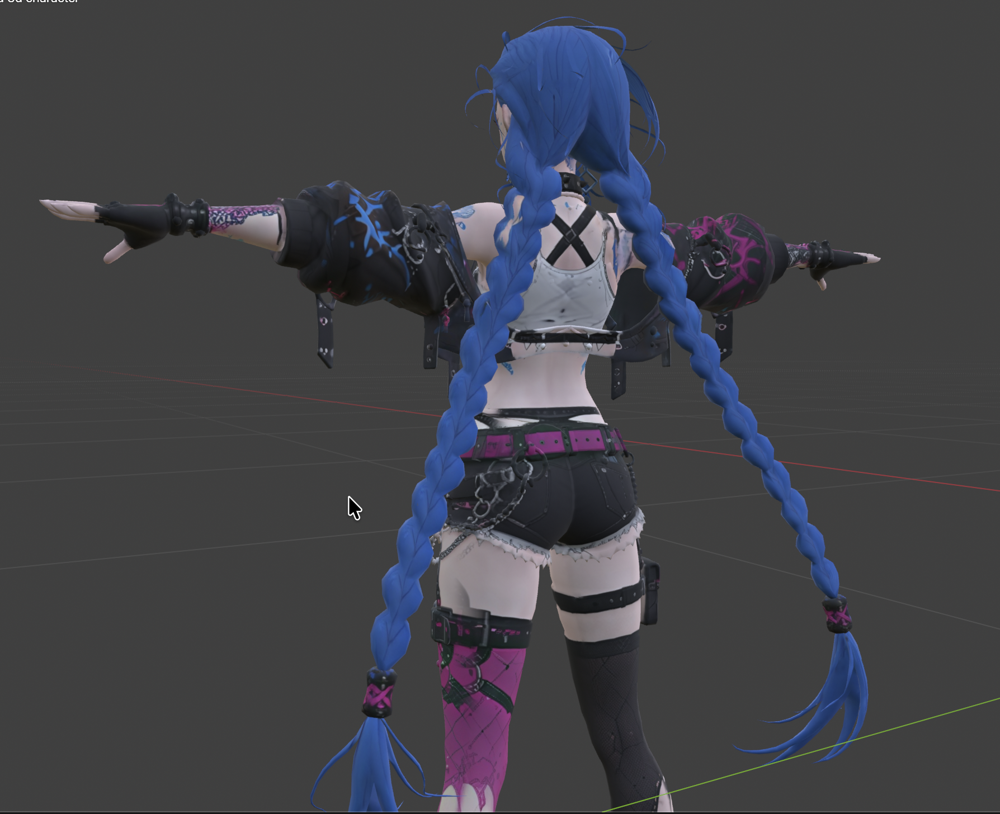

# Jinx 实验：分件生成、装配与整体生成对照

整理日期：2026-10-04。证据来自 `Readme_PIC/JINX/` 的八张结果图、`Readme_PIC/JINX/postprocess/` 的精修截图与检查记录，以及当日 Blender 当前场景。本文是单角色的定性案例分析，供报告和 presentation 使用。

## 实验目的与方法

本实验考察：将角色拆成 Head、Body & outfit、Hair 分别生成，能否获得可装配、可继续编辑的角色资产，以及相对于整体直接生成有哪些收益和代价。

两条路线围绕同一 Jinx 风格角色设计展开。Baseline 为已有的整体生成角色；本项目路线从整体设计和四视图派生部件参考，分别生成三维几何和贴图，再导出到 Blender 装配。Head、Body & outfit、Hair 保持独立对象，身体与服装仍是一个部件。四边形和目标面数属于请求配置，不以截图作为实际拓扑质量证明。

结果分为三个阶段：①应用交付的分件资产；②经过 Blender 尺度、位置、材质及接口调整后的装配结果；③进一步风格化与局部恢复的版本。后两阶段包含人工与外部 Codex 辅助处理，不能归为应用自动完成。现有记录没有把两条路线的随机种子、重试次数、累计费用和精修时间控制为一致，因此本实验用于比较可编辑性及具体视觉差异，不报告总体质量胜率或节省百分比。

图 1：角色整体设计。蓝色长辫、黑白服装和粉蓝配色作为两条路线的视觉目标。

图 2：整体四视图参考，用于约束正面、侧面和背面设计。

## 可以展示的实验结果

### 1. 三类资产可以独立生成并组成完整角色

图 3：导入 Blender 的独立头部、身体与服装、头发。此阶段的位置和尺度还没有统一；图中的分离状态体现交付对象的独立性，不是装配失败。

图 4：装配后的正面结果，保留完整 T-pose、服装配色和长辫轮廓。该结果验证了本案例的拆分方案可以组成完整静态角色。

当前 Blender 场景中，`Jinx` 集合仍包含独立 Head、Body、Hair 对象，旁边保留整体角色供对照。这使头部与头发可以单独选择、调整材质或恢复版本，无需同步重做身体。实际精修过程也分别处理了头颈接口、局部肤色和辫子恢复，提供了部件级操作的实例。

### 2. 独立头部保留了更明确的五官与张嘴表情，但角色身份仍会漂移

图 5a：分件装配结果的脸部近景。

图 5b：整体生成 baseline 的脸部近景。

分件头部呈现出更明确的眼部轮廓、嘴部开口和可辨认的牙齿外观；baseline 的眼部和嘴部细节更依赖模糊的纹理表达，额头与太阳穴也可见蓝色痕迹。这些截图支持“局部参考与独立生成可以改变并细化头部表现”。

但是，分件头部的笑容幅度、眼睛大小、脸型及妆容与整体设计存在差异，更偏二次元；baseline 在头、身体和材质的整体协调上仍有优势。因此，不能把“细节更明确”等同于“更像原设计”或“全面更好”。从全身图到独立头部参考的派生过程，本身就是角色身份漂移的潜在来源。

这里评估的是可见外观，不据此判断牙齿是否为独立网格、眼周拓扑是否适合动画，或表情是否可连续驱动。

### 3. 独立头发提供明确的编辑边界，背面细节仍需修整

图 6a：分件装配结果的背面。

图 6b：整体生成 baseline 的背面。

两条路线都保留了长辫和服装的主要背面结构。分件方案明确将头发独立交付，方便调整辫子位置、轮廓和颜色，也便于恢复头发版本而保留身体；baseline 的头发贴图可见较柔和的明暗变化，分件头发则颜色更饱和、与身体材质更容易出现风格差异。现有视角、尺度及材质不同，不据此宣称分件路线的几何细节全面更优。

分件结果的交叉背带可辨认，但白色衣服仍有模糊和斑驳纹理，局部边缘也需要精修。独立生成没有自动解决所有 UV 或贴图问题。

### 4. 头颈接口与局部材质可以在交付后继续处理

后续 Blender/Codex 处理记录包含头颈接缝填补、头皮颜色匹配、局部肤色恢复和辫子恢复。这说明导出资产可以继续修改，也揭示了分件路线额外承担的装配成本。

[neck_seam_audit.json](../Readme_PIC/JINX/postprocess/neck_seam_audit.json) 在一次接缝修复中记录：原有 5,305 个顶点未变、新增 27 个颈部顶点和 26 个封口面，脸部顶点位移为 0。[face_restoration_status.json](../Readme_PIC/JINX/postprocess/face_restoration_status.json) 记录该次恢复后头部与备份的位置差为 0；[skin_braids_restore_status.json](../Readme_PIC/JINX/postprocess/skin_braids_restore_status.json) 记录恢复了 20,752 个辫子顶点。上述数字描述各次操作记录，不等于重新验证当前未保存场景中的全部数据，也不证明跨部件已完成流形焊接。

可用于附录的后处理图片：

- [颈部衔接正面](../Readme_PIC/JINX/postprocess/10_neck_seam_front.png)、[侧面](../Readme_PIC/JINX/postprocess/11_neck_seam_side.png)。
- [辫子恢复后的全身](../Readme_PIC/JINX/postprocess/12_braids_restored.png)、[局部肤色恢复后的近景](../Readme_PIC/JINX/postprocess/13_skin_restored_detail.png)。

这些渲染中皮肤高光较强，适合展示操作结果；脸部质量的主对照建议使用图 5 的视口截图，以减少曝光对判断的影响。Blender 当前打开的是 `Jinx_scalp_matched.blend`，窗口带未保存标记，因此上述保存截图不标为“当前最终版本”。

## 结果汇总

| 评价维度 | 本案例的实际观察 | 报告结论 |
|---|---|---|
| 拆分可行性 | 三类部件独立交付，并装配成完整静态角色 | Head / Body & outfit / Hair 的拆分在本案例中可行 |
| 局部可编辑性 | 可分别操作头、身体和头发；已有接缝修补及辫子恢复记录 | 提供明确的局部编辑与版本恢复边界 |
| 面部表现 | 分件头部的五官、张嘴和牙齿外观更明确 | 局部生成具有细化空间，但不等于身份更一致 |
| 风格协调 | 独立头部偏二次元，头发更饱和；baseline 更统一 | 分件方案存在跨部件风格协调代价 |
| 材质与 UV | 衣服、背带仍有模糊和局部污染 | 不能声称拆分自动修复了贴图问题 |
| 下游可用性 | 可在 Blender 中装配、改材质、修接口并保留部件 | 支持继续编辑；本 Jinx 案例不作为完整动画验收 |
| Checker 增益 | 当前结果图未提供有 / 无 Checker 的成对实验 | 这些结果不单独证明 Checker 减少重试或提高质量 |
| 时间与费用 | 未提供该对照的完整计时和账单 | 不编造成本、速度或量化质量提升 |

## 可直接放进报告的实验结论

Jinx 案例验证了模块化角色生成的可行性：系统将角色拆分为头部、身体与服装、头发，分别生成并交付到 Blender，经过后续装配可以形成完整的静态角色。与整体直接生成的 baseline 相比，分件头部呈现出更明确的五官与张嘴表情，独立对象也为局部材质修改、头颈接口处理和头发版本恢复提供了清晰的操作边界。与此同时，独立参考和生成会引入脸型、表情及材质风格的偏移，baseline 在整体协调方面仍有优势，分件路线还需要额外的接口与尺度调整。本实验因此支持模块化方案在局部可控性和后续编辑上的价值，同时揭示了风格一致性与装配负担之间的取舍；它尚不构成总体视觉质量、成本优势或 Checker 有效性的量化证明。

## Presentation 展示顺序

1. 设计与四视图：说明共同的角色目标。
2. 三部件输出 → 装配全身：展示拆分方案确实可以落地。
3. 脸部并排对照：指出细节表现与身份一致性是两个不同维度。
4. 背面并排对照：展示独立头发及仍存在的材质问题。
5. Blender 中分别选择 Head、Body、Hair，展示局部编辑边界；接缝修补与辫子恢复作为附录证据。

陈述重点：本方案让局部生成、选择与后续编辑更明确，但需要承担跨部件协调和装配工作。精修图要标注外部 Blender/Codex 辅助，不混作原始生成结果。
